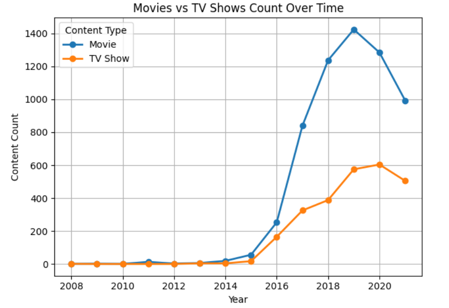
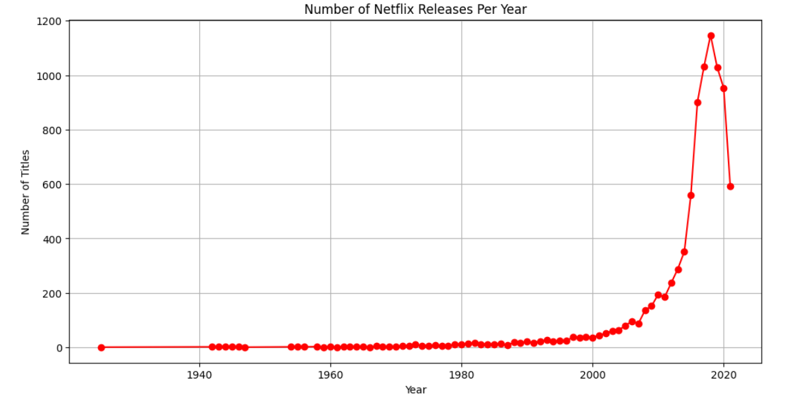
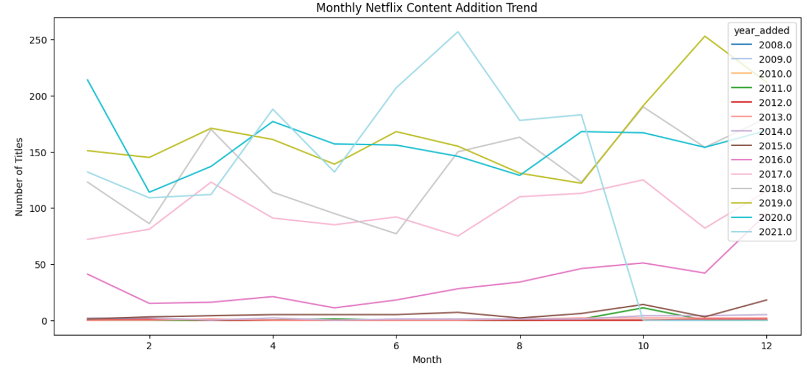

# Netflix Data Analysis

## 📌 Project Overview
This project explores **Netflix's Movies and TV Shows dataset** to uncover insights about content distribution, trends, and platform growth using **Python, Pandas, Matplotlib, and Seaborn**.

## 🔍 Objectives
- Perform **Exploratory Data Analysis (EDA)** on the Netflix dataset.
- Clean and preprocess data (handling missing values, formatting inconsistencies).
- Visualize trends in **content types, top countries, and release years**.
- Derive meaningful insights about Netflix's content strategy.

## 📂 Dataset Used
- **Netflix Movies & TV Shows Dataset** (Downloaded from Kaggle)
- Data includes **show ID, title, director, cast, country, release year, rating, and duration**.

## 🛠️ Technologies Used
- **Python** (Pandas, NumPy for data processing)
- **Matplotlib & Seaborn** (for visualizations)
- **Jupyter Notebook** (for interactive analysis)

## 📊 Key Findings
### 1️⃣ Movies vs. TV Shows Count
- Netflix has **more Movies than TV Shows**, indicating a stronger focus on movies.

### 2️⃣ Top 10 Countries with Most Content
- Certain countries, such as **United States**, dominate Netflix's content catalog.

### 3️⃣ Content Growth Over the Years
- Netflix has **expanded significantly after 2000**, producing more content in recent years.

## 📎 Code & Implementation
You can find the full **Jupyter Notebook** with code and visualizations in this repository.

## 🔗 Connect with Me
- **LinkedIn**: [Lakshay Bhandari](https://www.linkedin.com/in/lakshay-bhandari-b1b38a307/)
- **GitHub**: [isthatlak](https://github.com/isthatlak)